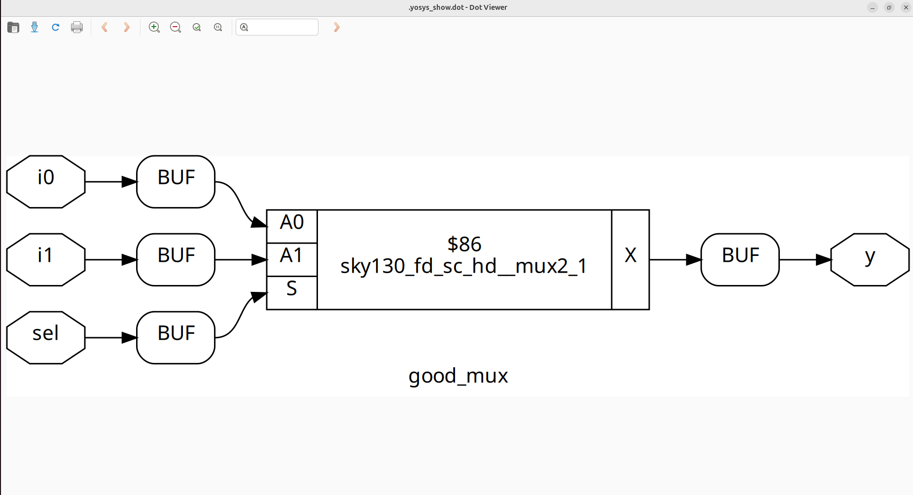

# 🚀 Day 1: Introduction to Verilog RTL Design & Synthesis

Welcome to **Day 1** of the **RTL Design and Synthesis Workshop**!

Today, you'll take your first step into the world of digital hardware design. We’ll explore:

- ✅ Writing Verilog RTL
- ✅ Simulating with **Icarus Verilog**
- ✅ Viewing waveforms using **GTKWave**
- ✅ Synthesizing designs with **Yosys**
- ✅ Understanding gate libraries and mapping

Each section includes **hands-on labs**, **commands**, and **visuals** to guide your learning.

---

## 📚 Table of Contents

1. [🔍 What is a Simulator, Design, and Testbench?](#1-🔍-what-is-a-simulator-design-and-testbench)
2. [⚙️ Getting Started with iverilog](#2-⚙️-getting-started-with-iverilog)
3. [🧪 Lab: Simulating a 2-to-1 Multiplexer](#3-🧪-lab-simulating-a-2-to-1-multiplexer)
4. [🧠 Verilog Code Analysis](#4-🧠-verilog-code-analysis)
5. [🛠️ Introduction to Yosys & Gate Libraries](#5-🛠️-introduction-to-yosys--gate-libraries)
6. [🏗️ Synthesis Lab with Yosys](#6-🏗️-synthesis-lab-with-yosys)
7. [✅ Summary](#7-✅-summary)

---

## 1. 🔍 What is a Simulator, Design, and Testbench?

### 🖥️ Simulator
A **simulator** is a software tool used to verify your circuit's functionality by running it with test inputs and checking outputs — **before** implementing it in hardware.

### 🔧 Design
Your **design** is the Verilog RTL code that defines the logic behavior of your circuit.

### 🧪 Testbench
A **testbench** is a Verilog module that *stimulates* the design with inputs and checks the outputs. It's like a lab setup for your digital circuit.

<div align="center">
  
</div>

---

## 2. ⚙️ Getting Started with iverilog

**Icarus Verilog** (`iverilog`) is an open-source Verilog simulation tool.

### 🔁 Simulation Flow

<div align="center">
  
</div>

> You provide both the **design** and **testbench** as input to `iverilog`.  
> The output `.vcd` file can be visualized using **GTKWave**.

---

## 3. 🧪 Lab: Simulating a 2-to-1 Multiplexer

Let’s simulate a basic **2-to-1 multiplexer** using `iverilog`.

### 🔽 Step 1: Clone the Workshop Repository

```bash
git clone https://github.com/kunalg123/sky130RTLDesignAndSynthesisWorkshop.git
cd sky130RTLDesignAndSynthesisWorkshop/verilog_files
```

### 🛠️ Step 2: Install Required Tools

```bash
sudo apt install iverilog
sudo apt install gtkwave
```
▶️ Step 3: Simulate the Design

Compile the design and testbench:
```bash
iverilog good_mux.v tb_good_mux.v
```
Run the simulation:
```bash

./a.out
```
View the waveform:
```bash
gtkwave tb_good_mux.vcd
```
<div align="center">  </div>

4. 🧠 Verilog Code Analysis

📄 good_mux.v
```bash
module good_mux (input i0, input i1, input sel, output reg y);
always @ (*)
begin
    if(sel)
        y <= i1;
    else 
        y <= i0;
end
endmodule
```
🔍 Explanation:

i0, i1 → Data inputs

sel → Select signal

y → Output

Logic: If sel == 1, output i1; otherwise output i0.

5. 🛠️ Introduction to Yosys & Gate Libraries
🧰 What is Yosys?

Yosys is a powerful, open-source synthesis framework that transforms Verilog RTL into a gate-level netlist.

✨ Key Features

RTL to gate-level synthesis

Optimization for speed, area, or power

Technology mapping to real hardware cells
Support for Sky130 and other PDKs

Extensible & scriptable

🧠 Why Multiple Gate "Flavors"?

A .lib file contains multiple versions of standard gates:

⏱️ Performance: Fast gates for timing-critical paths

🔋 Power: Low-power variants

📏 Area: Compact implementations

💪 Drive Strength: To drive larger loads

⚡ Signal Integrity: Noise-resistant gates

6. 🏗️ Synthesis Lab with Yosys

Now let’s synthesize the good_mux module using Yosys.

🧪 Step-by-Step Yosys Flow
1️⃣ Launch Yosys
```bash
yosys
```
2️⃣ Read the Liberty file (gate library)
```bash
read_liberty -lib /address/to/your/sky130/file/sky130_fd_sc_hd__tt_025C_1v80.lib
```
3️⃣ Load your Verilog design
```bash
read_verilog /home/vsduser/VLSI/sky130RTLDesignAndSynthesisWorkshop/verilog_files/good_mux.v
```
4️⃣ Synthesize the design
```bash
synth -top good_mux
```
5️⃣ Perform technology mapping
```bash
abc -liberty /address/to/your/sky130/file/sky130_fd_sc_hd__tt_025C_1v80.lib
```
6️⃣ Visualize the gate-level netlist
```bash
show
```
  

7. ✅ Summary

🎉 Great work! Here's what you achieved today:

✔️ Understood the roles of simulator, design, and testbench

✔️ Simulated a Verilog design using iverilog

✔️ Analyzed a 2:1 MUX implementation

✔️ Visualized waveforms in GTKWave

✔️ Synthesized RTL into gates using Yosys

✔️ Learned about technology libraries and their real-world impact

🔜 Up next: Dive deeper into synthesis strategies, flip-flop coding styles, and timing libraries on Day 2!
